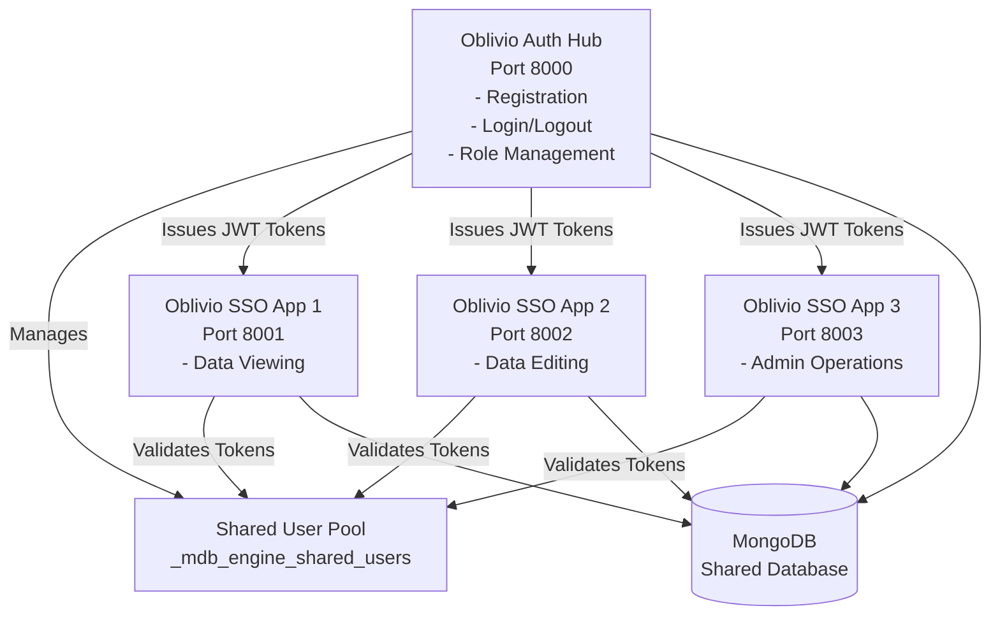

# Oblivio Apps v0: SSO Authentication Example

A complete working example demonstrating Single Sign-On (SSO) architecture where one central auth hub manages user authentication and three SSO-enabled apps validate tokens automatically.

## Architecture Overview



## Features

- **Auth Hub**: Handles user registration, login, logout, and role management
- **SSO Apps**: Validate tokens automatically via SSO middleware
- **Shared Authentication**: All apps use the same JWT secret and user pool
- **Role-Based Access**: Different roles (viewer, editor, admin) control access
- **SSO**: Login once, access all apps automatically
- **Per-App Roles**: Users can have different roles in different apps

## Quick Start

### Prerequisites

- Docker and Docker Compose
- Python 3.11+ (for local development)

### Running with Docker Compose

1. **Clone and navigate to the example:**

```bash
cd examples/advanced/oblivio-apps-v0
```

2. **Copy environment variables:**

```bash
cp .env.example .env
```

3. **Start all services:**

```bash
docker-compose up --build
```

4. **Access the apps:**

- **Auth Hub**: http://localhost:8000
- **SSO App 1**: http://localhost:8001
- **SSO App 2**: http://localhost:8002
- **SSO App 3**: http://localhost:8003

### Running with Bundled Dockerfile (Single Container)

For simplified deployment, you can run all apps in a single container:

1. **Start bundled services:**

```bash
docker-compose -f docker-compose.bundled.yml up --build
```

2. **Access the apps** (same URLs as above)

**Benefits of Bundled Approach:**
- Single container instead of 4 separate containers
- Reduced resource usage (~1GB vs ~2GB)
- Simplified deployment and monitoring
- Same functionality as multi-container setup

**When to Use:**
- Development and testing environments
- Small to medium deployments
- When resource efficiency is important
- When you don't need independent scaling of apps

**When to Use Multi-Container:**
- Production environments requiring independent scaling
- When apps need different resource limits
- When you need to update apps independently

## Usage Flow

### 1. Register a User

1. Visit http://localhost:8000/register
2. Enter email and password
3. Click "Register"
4. You'll be automatically logged in and redirected to the dashboard

### 2. Access SSO Apps

After logging in on the auth hub:

1. Visit any SSO app (e.g., http://localhost:8001)
2. You'll be automatically authenticated via SSO
3. No need to login again!

### 3. Manage Roles (Admin Only)

1. Login as admin on auth hub
2. Go to Dashboard
3. View all users and their roles
4. Grant/revoke access to SSO apps

## App Descriptions

### Auth Hub (Port 8000)

- **Registration**: Create new user accounts
- **Login/Logout**: Authenticate users and issue JWT tokens
- **Dashboard**: View users and manage roles
- **Role Management**: Grant/revoke access to SSO apps

### SSO App 1 (Port 8001)

- **Functionality**: Data viewing/listing
- **Required Role**: `viewer` (default)
- **Features**: View data, read-only operations

### SSO App 2 (Port 8002)

- **Functionality**: Data editing
- **Required Role**: `viewer` (to access), `editor` or `admin` (to edit)
- **Features**: Create, read, update data

### SSO App 3 (Port 8003)

- **Functionality**: Admin operations
- **Required Role**: `admin` (required)
- **Features**: Admin statistics, admin-only operations

## Configuration

### Environment Variables

All apps share these critical environment variables:

- `MONGODB_URI`: MongoDB connection string
- `MONGODB_DB`: Database name (must be same for all apps)
- `MDB_ENGINE_JWT_SECRET`: JWT secret (must be same for all apps for SSO to work)

See `.env.example` for all available options.

### Manifest Configuration

Each app has a `manifest.json` file that configures:

- **Auth mode**: `"mode": "shared"` enables SSO
- **Auth hub URL**: `"auth_hub_url": "http://localhost:8000"` - URL of the authentication hub for redirecting unauthenticated users. Can be overridden via `AUTH_HUB_URL` environment variable
- **Roles**: Available roles for the app
- **Required role**: Minimum role needed to access
- **Public routes**: Routes that don't require authentication

**Example manifest.json for SSO apps:**
```json
{
  "auth": {
    "mode": "shared",
    "auth_hub_url": "http://localhost:8000",
    "roles": ["viewer", "editor", "admin"],
    "require_role": "viewer",
    "public_routes": ["/health", "/auth/callback"]
  }
}
```

**Configuration Priority**:
1. `manifest.auth.auth_hub_url` (declarative, versioned)
2. `AUTH_HUB_URL` environment variable (runtime override)
3. Default: `http://localhost:8000` (fallback)

## Architecture Details

### SSO Authentication Flow

1. **User registers/logs in** on auth hub
2. **Auth hub authenticates** via `SharedUserPool`
3. **JWT token issued** and stored in cookie
4. **SSO apps validate token** automatically via `SharedAuthMiddleware`
5. **User can access** all authorized SSO apps

### Token Validation

- Tokens are validated on every request by `SharedAuthMiddleware`
- User info is available via `request.state.user`
- Roles are checked per-app from `user.app_roles[app_slug]`

### Role Management

- Roles are stored per-app in `app_roles` field
- Auth hub can update roles via API endpoints
- Roles are checked by each SSO app independently

## Security Considerations

1. **Shared JWT Secret**: All apps must use the same `MDB_ENGINE_JWT_SECRET`
2. **Secure Cookies**: Tokens stored in HttpOnly cookies
3. **Role Validation**: Each app validates roles independently
4. **Token Revocation**: Logout revokes tokens across all apps
5. **HTTPS**: Use HTTPS in production (set `secure=True` in cookies)

## Development

### Running Locally (without Docker)

1. **Install dependencies:**

```bash
pip install -e ".[casbin]"
pip install uvicorn fastapi jinja2 python-multipart
```

2. **Set environment variables:**

```bash
export MONGODB_URI="mongodb://localhost:27017"
export MONGODB_DB="oblivio_apps"
export MDB_ENGINE_JWT_SECRET="your-secret-key"
```

3. **Start MongoDB:**

```bash
docker run -d -p 27017:27017 --name mongodb mongo:7
```

4. **Run each app:**

```bash
# Terminal 1 - Auth Hub
cd apps/oblivio-auth-hub
python web.py

# Terminal 2 - SSO App 1
cd apps/oblivio-sso-app-1
python web.py

# Terminal 3 - SSO App 2
cd apps/oblivio-sso-app-2
python web.py

# Terminal 4 - SSO App 3
cd apps/oblivio-sso-app-3
python web.py
```

## Testing the Setup

1. **Start services**: `docker-compose up`
2. **Register user**: Visit http://localhost:8000/register
3. **Login**: Visit http://localhost:8000/login
4. **Access SSO apps**:
   - http://localhost:8001 (should auto-authenticate)
   - http://localhost:8002 (should auto-authenticate)
   - http://localhost:8003 (requires admin role)
5. **Manage roles**: Visit http://localhost:8000/dashboard (admin only)

## Troubleshooting

### SSO Not Working

- **Check JWT secret**: All apps must use the same `MDB_ENGINE_JWT_SECRET`
- **Check database**: All apps must use the same `MONGODB_DB`
- **Check cookies**: Ensure cookies are set with correct domain (localhost for local dev)

### Can't Access SSO Apps

- **Check roles**: User must have appropriate role for the app
- **Check manifest**: Verify `require_role` in manifest.json
- **Check logs**: Check container logs for authentication errors

### Role Management Not Working

- **Check admin access**: Only admins can manage roles
- **Check API endpoints**: Verify `/api/users/{email}/roles/{app_slug}` endpoint
- **Check database**: Verify user exists in `_mdb_engine_shared_users` collection

## Comparison with Other Auth Modes

| Feature | `mode: "app"` | `mode: "shared"` (This Example) |
|---------|---------------|----------------------------------|
| User Storage | Per-app collection | Shared collection |
| Login | Per-app | SSO across apps |
| Tokens | App-specific | Shared JWT |
| Roles | N/A | Per-app roles |
| Use Case | Isolated apps | Platform apps |

## Related Examples

- [Multi-App Shared](../multi_app_shared/README.md) - Similar SSO example
- [Multi-App](../multi_app/README.md) - Cross-app data access
- [Simple App](../simple_app/README.md) - Basic app setup

## File Structure

```
oblivio-apps-v0/
├── README.md                    # This file
├── docker-compose.yml           # Multi-container orchestration
├── docker-compose.bundled.yml   # Single-container orchestration
├── Dockerfile                   # Multi-container build
├── Dockerfile.bundled           # Single-container build
├── start-all-apps.py            # Bundled startup script
├── .env.example                 # Environment template
└── apps/
    ├── oblivio-auth-hub/        # Auth hub (central authentication)
    │   ├── manifest.json
    │   ├── web.py
    │   └── templates/
    ├── oblivio-sso-app-1/       # SSO app 1
    │   ├── manifest.json
    │   ├── web.py
    │   └── templates/
    ├── oblivio-sso-app-2/       # SSO app 2
    │   ├── manifest.json
    │   ├── web.py
    │   └── templates/
    └── oblivio-sso-app-3/       # SSO app 3
        ├── manifest.json
        ├── web.py
        └── templates/
```

## License

This example is part of MDB-Engine and follows the same license.
